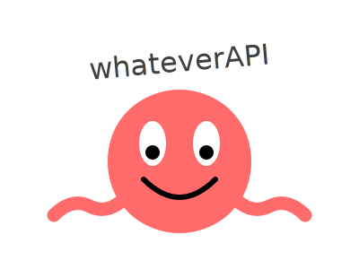

# WhateverAPI - A Modern Joke Management System with Next.js Frontend




[](https://wakatime.com/badge/user/633fcbd8-9377-4acb-9977-248bcf7b615b/project/865bcd59-7dfb-43a6-995c-ed1fb3762774)

## Project Overview
This project combines a robust .NET 9.0 RESTful API for joke management with a modern Next.js frontend. The system provides comprehensive capabilities for managing and serving humorous content, featuring advanced categorization, tagging, and engagement tracking, all wrapped in a user-friendly web interface.

## Features

### Core Functionality
- ✨ Full CRUD operations for joke management through both API and UI
- 🎲 Random joke retrieval with filtering options
- 🏷️ Advanced categorization system with tagging support
- 📊 Engagement tracking with laugh scores
- 🔍 Flexible search and filtering capabilities
- 🎨 Modern, responsive user interface built with Next.js
- 🌓 Dark mode support using Tailwind CSS

### Technical Features
- 🚀 Backend built on .NET 9.0 for optimal performance
- ⚡ Next.js 13+ with App Router for frontend
- ✅ Comprehensive validation using FluentValidation
- 📝 Detailed Swagger/OpenAPI documentation
- 🎯 TypeScript for enhanced development experience
- 🎨 Tailwind CSS for modern styling
- 🔒 JWT authentication with Google OAuth integration
- 🐳 Docker support for easy deployment

## Project Structure

### Backend (.NET API)
```
src/
├── Data/
│   ├── AppDbContext.cs           # EF Core database context
│   ├── BaseRepository.cs         # Generic repository pattern
│   ├── DbInitializer.cs          # Database seeding
│   └── JokeRepository.cs         # Joke repository
├── Services/
│   ├── JokeService.cs           # Joke business logic
│   ├── TagService.cs            # Tag management
│   ├── JwtTokenService.cs       # Authentication
│   └── GoogleAuthService.cs     # OAuth integration
├── Models/
│   ├── Request.cs               # Request DTOs
│   └── Response.cs              # Response DTOs
└── Program.cs                   # Application entry point
```

### Frontend (Next.js)
```
app/
├── components/
│   ├── JokeForm.tsx            # Joke submission form
│   └── ui/                     # Reusable UI components
├── lib/
│   └── api.ts                  # API integration
├── styles/
│   └── globals.css             # Global styles
└── page.tsx                    # Main page component
```

## Getting Started

### Prerequisites
- .NET 9.0 SDK
- Node.js 18+ and npm/yarn
- PostgreSQL 15+
- Docker (optional)

### Backend Setup

1. Clone the repository:
```bash
git clone https://github.com/yourusername/whateverAPI.git
cd whateverAPI
```

2. Update database connection in `appsettings.json`:
```json
{
  "ConnectionStrings": {
    "DefaultConnection": "Host=localhost;Database=whateverdb;Username=postgres;Password=postgrespw;"
  }
}
```

3. Run the API:
```bash
dotnet restore
dotnet run
```

### Frontend Setup

1. Navigate to the Next.js directory:
```bash
cd frontend
```

2. Install dependencies:
```bash
npm install
```

3. Start the development server:
```bash
npm run dev
```

The application will be available at:
- Frontend: http://localhost:3000
- API: http://localhost:5000
- Swagger UI: http://localhost:5000/swagger

## API Endpoints

### Joke Management

#### Create Joke
```http
POST /api/jokes
Content-Type: application/json

{
  "content": "Why did the developer quit his job? He didn't get arrays!",
  "type": "Programming",
  "tags": ["programming", "work"],
  "isActive": true
}
```

#### Get Random Joke
```http
GET /api/jokes/random
```

#### Search Jokes
```http
POST /api/jokes/find
Content-Type: application/json

{
  "type": "Programming",
  "query": "developer",
  "active": true,
  "pageSize": 10,
  "pageNumber": 1,
  "sortBy": "laughScore",
  "sortDescending": true
}
```

## Frontend Components

### JokeForm
The main form component for submitting new jokes:
```typescript
import { useState } from 'react';

export default function JokeForm() {
    const [jokeContent, setJokeContent] = useState('');
    // Form implementation...
}
```

### Styling
The project uses Tailwind CSS with a custom configuration:
```typescript
// tailwind.config.ts
export default {
  content: [
    "./pages/**/*.{js,ts,jsx,tsx,mdx}",
    "./components/**/*.{js,ts,jsx,tsx,mdx}",
  ],
  theme: {
    extend: {
      colors: {
        background: "var(--background)",
        foreground: "var(--foreground)",
      },
    },
  },
}
```

## Configuration

### Environment Variables
Create a `.env.local` file in the frontend directory:
```env
NEXT_PUBLIC_API_URL=http://localhost:5000
NEXT_PUBLIC_GOOGLE_CLIENT_ID=your-client-id
```

### Authentication Settings
Configure JWT and Google OAuth in `appsettings.json`:
```json
{
  "JwtOptions": {
    "Secret": "your-secret-key",
    "Issuer": "your-issuer",
    "ExpirationInDays": 90
  },
  "Authentication": {
    "Google": {
      "ClientId": "your-client-id",
      "ClientSecret": "your-client-secret"
    }
  }
}
```

## Development Guidelines

### Backend
- Follow C# coding conventions
- Include XML documentation for public APIs
- Implement proper error handling
- Add appropriate logging
- Write unit tests for new features

### Frontend
- Use TypeScript for all new components
- Follow Next.js best practices
- Implement proper error handling
- Use Tailwind CSS for styling
- Write unit tests using Jest

## Error Handling

The API uses RFC 7807 Problem Details:
```json
{
  "type": "https://httpstatuses.com/404",
  "title": "Resource Not Found",
  "status": 404,
  "detail": "Joke with ID '123' was not found",
  "traceId": "00-1234567890abcdef-abcdef1234567890-00"
}
```

## Contributing

1. Fork the repository
2. Create a feature branch
3. Commit your changes
4. Push to the branch
5. Create a Pull Request

### Commit Guidelines
Use conventional commits:
- feat: New feature
- fix: Bug fix
- docs: Documentation changes
- style: Code style changes
- refactor: Code refactoring
- test: Adding tests
- chore: Maintenance tasks

## License

This project is licensed under the MIT License.

## Support

For support, please open an issue in the GitHub repository or contact the maintainers.